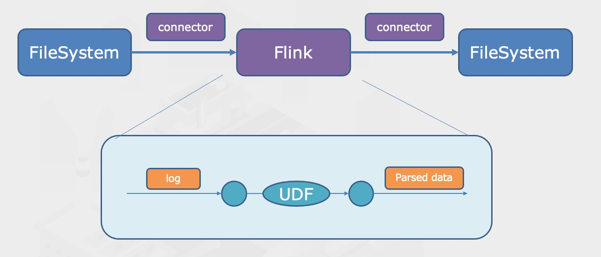
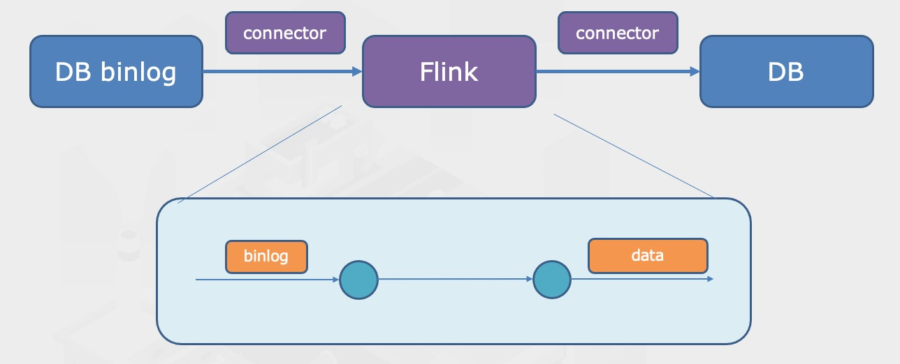
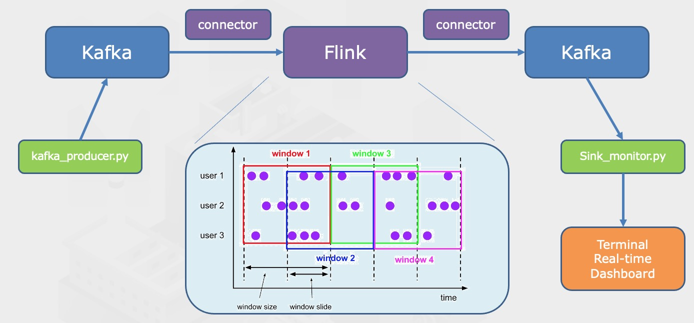
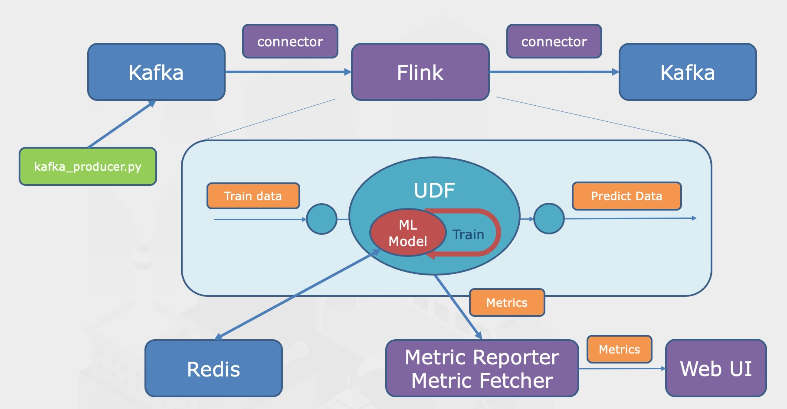
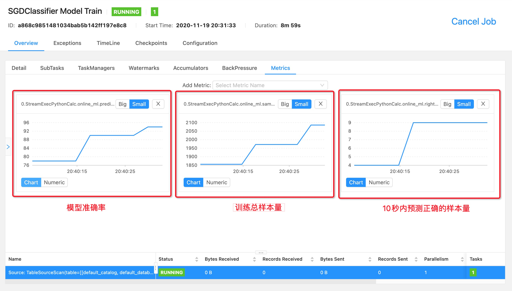
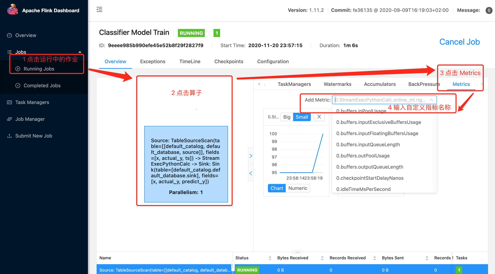

# PyFlink 从入门到精通

* [1、批处理 Word Count](#1批处理-word-count)
* [2、自定义函数 UDF](#2自定义函数-udf)
* [3、实时 MySQL CDC](#3实时-mysql-cdc)
* [4、实时排行榜](#4实时排行榜)
    * [4.1、准备1：数据模拟器](#41准备1数据模拟器)
    * [4.2、准备2：kafka 监控](#42准备2kafka-监控)
    * [4.3、准备3：Java 编写的 UDF](#43准备3java-编写的-udf)
    * [4.4、运行](#44运行)
    * [4.5、排行榜可视化](#45排行榜可视化)
* [5、在线机器学习 Online Machine Learning](#5在线机器学习-online-machine-learning)
    * [5.1、在线学习背景介绍](#51在线学习背景介绍)
    * [5.2、实现逻辑详解](#52实现逻辑详解)
        * [5.2.1、模型的训练](#521模型的训练)
        * [5.2.2、模型的监控](#522模型的监控)
        * [5.2.3、模型的服务](#523模型的服务)
    * [5.3、准备1：数据生成器](#53准备1数据生成器)
    * [5.4、准备2：模型预测服务](#54准备2模型预测服务)
    * [5.5、运行](#55运行)
    * [5.5、模型监控](#56模型监控)


Flink 是目前非常火热的流处理框架，可以很好地实现批流一体，即一套代码即可以用于批处理，也可以用于流处理。

官方文档很好地解释了 Flink 的基础概念和工作原理，但是对于 Python 开发者而言少了很多例子，很难快速基于 PyFlink 进行开发。

本文档基于常见的业务场景，提供了一些案例，来帮助小伙伴们快速上手 PyFlink。

在上手之前，先大致介绍一下 PyFlink：
1. PyFlink 是 Flink 对 Java API 的一层封装，运行时会启动 JVM 来与 Python 进行通信。
2. PyFlink 提供了多种不同层级的 API，层级越高封装程度越高（建议在 SQL API 或 Table API 进行编程），层级由高到低分别为:
    1) SQL API
    2) Table API
    3) DataStream API / DataSet API
    4) Stateful Streaming Processing
3. Flink 在做批处理的时候，是将批数据当成特殊的流数据来处理。

本教程的建议使用步骤是：
1. 按顺序实践。
1. 阅读每个案例的代码，理解每个部分的作用。
1. 阅读每个案例的代码头部文档里提到的扩展阅读，加深理解。

再次强调，在运行前，先检查：
1. Python 版本是否是 3.5、3.6 或 3.7。
1. Docker 是否已经启动，MySQL、Kafka、Zookeeper、Redis 容器是否正在运行。
1. Flink 是否正确安装。

## 1、批处理 Word Count

> **业务场景**
> 
> 通过 Flink 对文件存储系统里的数据进行离线批处理，并将结果存储到其他文件下同下。


该案例展示了如何用 Flink 做批处理，统计指定文件下的单词数，并将统计结果写入到新的文件下。

cd 到 `examples/1_word_count` 路径下，运行命令为：

```
flink run -m localhost:8081 -py batch.py
```

很快就能运行完，登录 [http://localhost:8081](http://localhost:8081) 应该可以看到有个已经完成的任务。

`batch.py` 批处理脚本执行逻辑是：
1. 首先，创建 Blink 批处理环境。（关于 Blink 和 Flink 的区别，见脚本 `1_word_count/batch.py` 的文件头）。
2. 然后，创建源表（source），这里使用 `filesystem` 作为连接器，按照指定的 `csv` 格式来批量地读取指定路径的文件（或文件夹）。
3. 接着，创建结果表（sink），这里同样使用 `filesystem` 连接器，以便将处理后结果写入目标文件（或文件夹）内。
4. 最后，编写批处理逻辑，完成批处理任务。

对于上述每个阶段的实现，`batch.py` 脚本提供了基于 Table API 和基于 SQL API 这两种不同方式的实现。

SQL API 是对 Table API 的更高层次的封装，内部实现了一些优化，便于阅读，但相对地功能没有 Table API 来得全面和强大，本质上并无不同之处，读者根据需求可自行选择实现方法。

运行后的结果写到了同级目录下的 result 目录中，被拆分为若干个小文件，所有小文件的内容汇总后可以得到如下内容（此处不显示如何汇总）：

```
flink,3
pyflink,2
```

通过本案例，可以学到：
1. 如何创建批处理环境。
2. 如何创建数据源表和结果表，实现有单一流入和单一流出的 dataflow 的处理。
3. 如何用 Table API 和 SQL API 实现聚合逻辑。

## 2、自定义函数 UDF

> **业务场景**
> 
> 通过 Flink 对系统上报的日志进行实时解析并生成告警，搭建实时监控告警系统。



该案例是对线上实时监控告警的一小部分进行了改造（线上是流处理，本案例改成了批处理），展示了如何在 Flink 中使用自定义函数 UDF 、三方的依赖包，来实现复杂的日志解析逻辑。

同时，本案例也是 [官方文档](https://ci.apache.org/projects/flink/flink-docs-master/zh/dev/python/table-api-users-guide/udfs/python_udfs.html)
里的标量函数（ Scalar Function ）的一个简单实现，在 PyFlink 1.11 里的 UDF 已经比较强大了，更多技巧请前往官方文档进行学习。

本案例中，除了使用了自定义函数 UDF ，还使用了三方包 faker，因此需要额外提供一个描述依赖的文件 `requirements.txt` 。官方文档提供了两种方式来导入：

```python
# 方式1：直接传入 requirements.txt ，当集群可以联网时，会下载这些依赖项
t_env.set_python_requirements("requirements.txt")

# 方式2：当集群不能联网时，可以先准备好一个由 requirements.txt 生成的包含有安装包的依赖文件夹 cached_dir ，集群会离线安装这些依赖项
t_env.set_python_requirements("requirements.txt", "cached_dir")
```

方式 2 相比于方式 1 有两点好处：
1. 将依赖下载与作业执行解耦，提高了作业执行的效率。
1. 依赖项的安装包预先下载好，适用于集群不能联网的情况。

首先，cd 到 `examples/2_udf` 路径下，生成包含有安装包的 cached_dir 文件夹：

```bash
pip download -d cached_dir -r requirements.txt --no-binary :all:
```

然后，运行命令以提交批处理作业：

```bash
flink run -m localhost:8081 -py batch.py
```

登录 [http://localhost:8081](http://localhost:8081) 可以看到有个正在运行的任务，大约半分钟左右运行完。

运行后的结果写到了同级目录下的 result 目录中：

```
syslog-system,爱尔兰,,,,,,
syslog-system,圣皮埃尔岛及密克隆岛,,,,,,
......
```

通过本案例，可以学到：
1. 如何创建并注册 UDF 。
1. 如何导入 python 的三方依赖包，并在 UDF 中使用。
1. 如何使用 UDF 。

## 3、实时 MySQL CDC

该案例展示了如何用 Flink 进行 MySQL 数据库的实时同步。

> **业务场景**
> 
> 监听 MySQL 的 binlog 数据变更，并实时同步到另一个 MySQL。



`CDC` 是 `change data capture`，即变化数据捕捉。CDC 是数据库进行备份的一种方式，常用于大量数据的备份工作。

CDC 分为入侵式的和非入侵式两种：
* 入侵式：如基于触发器备份、基于时间戳备份、基于快照备份。
* 非入侵式：如基于日志的备份。

MySQL 基于日志的 CDC 就是要开启 mysql 的 binlog（ binary log ）。
如果使用本教程的 docker-compose 安装的 MySQL 8.0.22，默认是开启 binlog 的。
实际业务 MySQL 可能未开启 binlog，可以通过执行下面的命令，查看 `log_bin` 变量的值是否为 `ON`。

```mysql
show variables like '%log_bin%';
```

为了在 Flink 中实现 MySQL 的 CDC，我们需要准备下面 3 个 jar 包（案例文件夹下面有）。
1. flink-connector-jdbc_2.11-1.11.2.jar：通过 JDBC 连接器来从 MySQL 里读取或写入数据。
2. flink-sql-connector-mysql-cdc-1.1.0.jar：通过 MySQL-CDC 连接器从 MySQL 的 binlog 里提取更改。
3. mysql-connector-java-5.1.49.jar：JDBC 连接器的驱动（ 帮助 java 连接 MySQL ）。

关于 jar 包的使用：
1. 创建 source 表的时候，定义连接器为 mysql-cdc ，写法请参照 [文档](https://ci.apache.org/projects/flink/flink-docs-stable/zh/dev/table/connectors/jdbc.html) 。
1. 创建 sink 表的时候，定义连接器为 jdbc，写法请参照 [文档](https://github.com/ververica/flink-cdc-connectors) 。
1. 由于 source 表可能有更新或删除，因此只能使用 upsert 模式来实现实时同步，该模式要求 sink 表里设置主键（ primary key）。

好了，简单介绍完 CDC，让我们进入正文。

cd 到 `examples/3_database_sync` 路径下，运行命令为：

```
python stream.py
```

PS：如果像前面案例一样使用 flink run 运行的话，会报错：`Caused by: java.lang.NoSuchMethodError: 'void sun.misc.Unsafe.monitorEnter(java.lang.Object)'`，暂时没有找到解决方法。。

如果本地有 MySQL 客户端，可以同时连接 3306 和 3307 这两个端口（账密都是 root）。在 3306 对应的实例上的 flink 数据库的 case3 这张表里做相应的增删改，然后看看 3307 对应的同名的表里，是否已经实时同步了数据。

通过本案例，可以学到：
1. 如何创建流处理环境。
2. 如何使用各类 connector ，以及如何管理在 pyflink 脚本中指定 jar 依赖。
3. 如何实现实时数仓的数据同步。

## 4、实时排行榜

> **业务场景**
> 
> 实时点击量排行榜。统计过去 1 分钟内，点击量最高的男女用户各 10 名及其具体的点击数，同时每隔 1 秒更新统计结果，并将统计结果同步到 kafka

该案例展示了如何用 Flink 进行有状态的流处理，通过 Slide 窗口函数实时更新统计结果，得到排行榜数据。



由于本案例稍微有些复杂，因此需要做一些前置准备 —— 数据模拟器和监控脚本 —— 然后再开始运行实时计算。

### 4.1、准备1：数据模拟器

首先，请保证基于 docker 运行的 kafka 服务是正常运行的，且映射到 localhost:9092 。

在 `4_window` 目录下的 `kafka_producer.py` 脚本，提供了数据模拟器的功能。

它会往 kafka 服务的 user_action 主题里，每秒写入 20 条模拟数据，数据格式为 json 字符串，如下：

```bash
{
    "ts": "2020-01-01 01:01:01",  # 当前时间
    "name": "李华",  # 从根据性别随机产生的 50 个姓名里随机选择
    "sex": "男",  # 性别，60%概率为“男”，40%概率为“女”
    "action": "click",  # 动作，90%概率为“click”，10%概率为“scroll”
    "is_delete": 0,  # 是否要丢弃，90%概率为“0”（不丢弃），10%概率为1“丢弃”
}
```

为了使得最后的结果不至于太平均，只初始化了 50 个用户，该 50 个用户有不同的概率来产生上面的数据。

运行命令如下：

```bash
python kafka_producer.py
```

### 4.2、准备2：kafka 监控

Flink 脚本会从 source 表里读取数据，经过实时计算后将结果写入 sink 表，其中 source 表与 sink 表分别对应着 kafka 的不同主题。

启动 2 个终端，其中一个用于监控 source 表（主题为 user_action ），运行命令为：
```bash
python source_monitor.py
``` 

可以看到有源源不断的数据被打印出来，如果觉得太多，可以终止该任务。

另一个终端用于监控 sink 表（主题为 click_rank ），运行命令为：

```bash
python sink_monitor.py
``` 

`sink_monitor.py` 脚本会将排行榜结果进行实时打印，当前还没有运行 Flink 作业，所以没有结果。

### 4.3、准备3：Java 编写的 UDF

这一步可以跳过，因为我已经给你准备好了 `flink-udf-1.0-SNAPSHOT.jar` 包，下面对这个 jar 包的使用、UDAF 的开发做个简单说明。

在 PyFlink 1.11.2 版本，还不支持用 Python 直接编写聚合函数（ UDAF ），因此需要先用 java 来编写聚合函数，然后以 jar 包的形式导入到 python 中。

本案例提供了 `flink-udf-1.0-SNAPSHOT.jar` UDF 包，内置了如下几种开箱即用的 UDF 或 UDTF:
1. JavaUpper：使用 java 的 String.toUpperCase 将字符串中的小写字母转大写，用法为 `JavaUpper(s)`。
1. Top2：继承自 TableAggregateFunction，用于 groupby 后统计最大的 2 个数，可参考 [表值聚合函数](https://ci.apache.org/projects/flink/flink-docs-release-1.11/zh/dev/table/functions/udfs.html#%E8%A1%A8%E5%80%BC%E8%81%9A%E5%90%88%E5%87%BD%E6%95%B0) ，用法为 `Top2(value)`。
1. TopN：本次案例的主角，继承自 AggregateFunction，用于 groupby 后统计出现次数最多的 N 个名称及其出现次数，并将结果拼接为字符串（如 `"{\"name1\":count1}, {\"name2\":count2}, ..."`），用法为 `TopN(name, N, 1)`，其中 N 是 TopN 里的 N，为固定值。
1. WeightedAvg：继承自 AggregateFunction，用于 groupby 后统计出加权平均值，用法为 `WeightedAvg(value, weight)`。

本次用到的 TopN 函数，具体实现请前往 `4_window/java_udf/src/main/java/com/flink/udf/TopN.java` ，内部有详细的注释，请结合官方文档 [Aggregation Functions](https://ci.apache.org/projects/flink/flink-docs-release-1.11/dev/table/functions/udfs.html#aggregation-functions) 阅读。    

如果还要自行开发 udf 的话，可以参考上述路径下的其他 java 脚本，具体写法此处不赘述。udf 开发完之后，cd 到上层的 4_window/java_udf 路径下，然后使用 maven 进行打包：

```bash
mvn clean package
```

几秒之后，打包完的 jar 包会在当前目录新生成一个 target 文件夹，里面有一个名为 flink-udf-1.0-SNAPSHOT.jar 的文件，拷贝出来放在 4_window 目录下，替换掉原来的 flink-udf-1.0-SNAPSHOT.jar 即可。

### 4.4、运行

cd 到 `examples/4_window` 路径下，运行命令为：

```bash
flink run -m localhost:8081 -py stream11.py
```

运行之后，可以在 [localhost:8081](localhost:8081) 看到提交的名为 `Top10 User Click` 的 flink 作业。

PS: control + C 不能彻底终止脚本，因为脚本已经提交了，需要在 [localhost:8081](localhost:8081) 里点击对应的 job 然后再点击右上角的 Cancel Job 才算彻底终止。

下面对 `stream11.py` 脚本里的重要内容做一下说明。

首先，要使用 TopN 聚合函数，注册步骤为 3 步，如下所示：

```python
import os
from pyflink.datastream import StreamExecutionEnvironment
from pyflink.table import StreamTableEnvironment, EnvironmentSettings

# 第一步：初始化流处理环境，注意此处一定要指定 StreamExecutionEnvironment，否则无法导入 java 函数
env = StreamExecutionEnvironment.get_execution_environment()
env_settings = EnvironmentSettings.new_instance().in_streaming_mode().use_blink_planner().build()
t_env = StreamTableEnvironment.create(env, environment_settings=env_settings)

# 第二步：导入 jar 包依赖
dir_java_udf = os.path.join(os.path.abspath(os.path.dirname(__file__)), 'flink-udf-1.0-SNAPSHOT.jar')
t_env.get_config().get_configuration().set_string("pipeline.classpaths", 'file://' + dir_java_udf)

# 第三步，注册 java 函数，命名为 getTopN
t_env.register_java_function('getTopN', 'com.flink.udf.TopN')
```

getTopN 函数的使用就跟 mysql 里的 sum 等函数差不多。

本次希望实现一个排行榜的功能，滑动窗口宽度为 1 分钟（即对过去的 1 分钟数据进行统计），窗口滑动步长为 1 秒（即每 1 秒更新一次统计结果），同时还希望可以区分男女，因此在聚合的时候，要对窗口和性别同时进行聚合。

有 2 种方式来实现：
1. 基于 SQL API:
    1. 在 GROUP BY 里使用 HOP 滑动窗口函数，入参分别为：时间戳、滑动步长、窗口长度
    1. 在 SELECT 里使用 HOP_START 和 HOP_END 来获得滑动窗口的开始时间和结束时间
1. 基于 Table API:
    1. 创建长度为 60 秒、滑动步长为 1 秒的滑动窗口 slide_window ，并重命名为 w
    1. 使用 w.start, w.end 来获得滑动窗口的开始时间与结束时间

两种的具体实现，均已在 `stream11.py` 脚本里，可自行查阅。

### 4.5、排行榜可视化

可以在前面运行 `sink_monitor.py` 监控脚本的终端里看到实时更新的排行榜数据。此处为了简化显示，排行榜只看 top5，如下:

```bash
=== 男 ===
刘备    80
张飞    72
韩信    70
关云长  30
曹操    23
=== 女 == 
大乔    60
小乔    55
貂蝉    32
甄宓    13
蔡琰    4
```

通过本案例，可以学到：
1. 如何导入 java 依赖包。
1. 如何调整流处理环境的初始化，来注册自定义的 java 聚合函数。
1. 如何在滑动窗口中使用聚合函数。

## 5、在线机器学习 Online Machine Learning

> **业务场景**
> 
> 利用实时数据，在线训练一个机器学习模型，并实现对模型训练过程的实时监控。

本案例展示了如何用 PyFlink + Scikit-Learn 进行在线机器学习，以及提供实时的模型预测服务。

### 5.1、在线学习背景介绍

准确地说，在线学习并不是一种模型，而是一种模型的训练方法。
能够根据线上反馈数据，实时快速地进行模型调整，形成闭环的系统，同时也使得模型能够及时反映线上的变化，提高线上预测的准确率。

在线学习与离线学习，在数据的输入与利用上有明显的区别：
1. 在线学习的训练数据是一条条（或者是 mini-batch 微批少量）进来的，不像离线学习时可以一次性加载大量的数据。
2. 在线学习的数据只能被训练一次，过去了就不会再回来，不像离线学习可以反复地在数据集上训练模型。

很容易发现，对于在线学习，模型每次只能沿着少量数据产生的梯度方向进行下降，而非基于全局梯度进行下降，整个寻优过程变得随机，因此在线学习的效率并没有离线学习的高。但同时由于它每次参与训练的样本量很小，我们并不需要再用大内存、高性能的机器了，直接好处就是省钱呀。

对在线学习有兴趣的同学可以看一下这篇文章：[在线学习（Online Learning）导读](https://zhuanlan.zhihu.com/p/36410780)

### 5.2、实现逻辑详解



本案例相比于案例 4 要更复杂。这里稍微解释一下上面的数据流向图，以便于理解整个在线学习的流程。

在线学习项目，分为 3 个部分：
1. 模型的训练 Online Learning ：利用有标签的流式训练数据，来进行增量学习，不断地更新模型参数。
2. 模型的监控 Model Monitor ：在 UDF 里自定义监控指标，然后利用 Flink 的 Metric 机制，可以在自带的 WebUI 里实时查看。
3. 模型的服务 Online Serving ：在 UDF 里设定模型的加载与保存逻辑，并利用 Flask 加载 Redis 里的最新模型以提供服务。

下面拆开来介绍。

#### 5.2.1、模型的训练

1. `数据准备`：利用 `kafka_producer.py` 脚本，读取 Scikit-Learn 提供的手写数字数据集 digits ，随机打乱后写到 Kafka 里，模拟线上【已经做了特征工程】的实时数据，等待流处理任务来消费。
```bash
{
    "ts": "2020-01-01 01:01:01",  # 当前时间
    "x": [0, 1, 2, 16, ...],  # 展平后的图像灰度数据，包含有 64 个整数的数组，整数的定义域为 [0, 16]
    "actual_y": 1,  # 真实标签
}
```
1. `数据读取`：提交 PyFlink 作业后，Flink 利用连接器从 Kafka 里消费数据，强调一下本作业主要用于模型训练，不应该把特征工程耦合进来。
1. `模型加载`：UDF 在初始化的时候，会先从 Redis 里尝试加载预训练好的模型，如果 Redis 里不存在模型数据，则会初始化一个。
1. `模型训练`：每来一条数据，则会调用一次 UDF 的 eval 方法，方法内部会调用模型的 `partial_fit` 方法来训练，更新模型的参数。
1. `模型预测`：在 UDF 的 eval 方法里，完成本次的训练后，还会对训练用到的样本做个预测，预测结果一方面作为 UDF 的输出，写回到 Kafka ，另一方面用于计算相关的指标，以实时监控模型的效果。
1. `模型备份`：如果不对模型进行备份，那么模型只会在内存中，如果作业挂掉就前功尽弃了；在 UDF 中同样要设定模型的备份规则，我这里是 10 秒一次，备份到 Redis。

#### 5.2.2、模型的监控

1. `指标注册`：在 UDF 的 open 方法里，对几个监控指标（ Metric ）进行注册。
1. `指标计算`：在 UDF 的 eval 方法里，完成模型预测后，再计算之前定义的监控指标。
1. `指标收集`：这一步是 Flink 自动完成的，Flink 会利用 Metric Reporter 收集指标到存储或分析系统。
1. `指标可视化`：在 Flink Dashboard （[http://localhost:8081](http://localhost:8081) ）可以看到指标的当前值和历史变化趋势，下面是我在案例中实现的其中 3 个指标。

1. `告警通知`： 本案例里没有做，但在生产环境很重要，如果模型的某些指标出现了超过预期的异常，会影响到线上的预测服务，也就影响了用户体验。

#### 5.2.3、模型的服务

1. `Web框架`：本案例基于 Flask 框架，实现网页的渲染和提供预测 API 服务，Flask 相比于 Django 更轻量也更易开发。运行 `model_server.py` 后打开主页 [http://localhost:8066](http://localhost:8066) 。
<div align="center">    

</div>
1. `模型加载`：由于模型体积很小，因此无论是否有在实时训练，每次调用预测 API 时都会从 Redis 里动态加载最新的模型；实际线上运行时，需要异步地确认模型版本、异步地加载模型。
1. `特征工程`：线上传过来的手写数据是类型为 `image/svg+xml;base64` 的字符串，而模型需要的数据为 1 * 64 的灰度数组，因此需要做数据转换，这里就统称为特征工程，主要用到了 `PIL` / `Svglib` / `numpy` 等框架。
1. `模型预测`：数据处理完成后，直接喂给加载好的模型，调用模型的 `predict` 方法得到预测结果，再用 Flask 的 jsonify 函数序列化后返回给前端。

### 5.3、准备1：数据生成器

就像案例 4 一样，在运行脚本之前，我们先准备好数据和相关脚本。

首先，请保证基于 docker 运行的 kafka 服务是正常运行的，且映射到 localhost:9092 。

在 `5_online_machine_learning` 目录下的 `kafka_producer.py` 脚本，提供了数据模拟器的功能。

它会往 kafka 服务的 handwritten_digit 主题里，每秒写入 10 条 Scikit-Learn 的 digits 数据集里的样本，数据格式为 json 字符串，如下：

```bash
{
    "ts": "2020-01-01 01:01:01",  # 当前时间
    "x": [0, 1, 2, 16, ...],  # 展平后的图像灰度数据，包含有 64 个整数的数组，整数的定义域为 [0, 16]
    "actual_y": 1,  # 真实标签
}
```

运行命令如下：

```bash
python kafka_producer.py
```

### 5.4、准备2：模型预测服务

难道一定要等模型训练好了，我们才可以使用模型吗？NoNoNo，都 0202 年了，在线学习过程中的模型，也可以直接使用！

在流处理脚本 `stream.py` 中，我定义的 UDF 会每隔 10 秒往 Redis 里备份模型数据，我们可以把模型拿出来！

首先，请保证基于 docker 运行的 redis 服务是正常运行的，且映射到 localhost:6379 。

然后，预测服务需要做一些跟图像有关的预处理（把 base64 图片数据转为模型支持的矩阵），需要额外安装一些图形处理包，我把这些依赖整理在了案例目录下的 `server_requirements.txt` 文件内，pip 安装：

```bash
pip install -r server_requirements.txt
```

最后，启动 Flask App ：

```bash
python model_server.py
``` 

打开网页 [http://127.0.0.1:8066/](http://127.0.0.1:8066/)，可以看到一个很简单的画板，我们在蓝框里使用鼠标来手写一个数字，再点击【预测】看看。


可以看到控制台的两条消息，一条是你手写数字的 base64 编码，另一条的报错是因为 Redis 没有启动，或者 Redis 里还没有任何模型数据。

别着急，接下来，让我们边训练模型，边在网页上查看模型的预测能力是怎么实时进化的吧！

### 5.5、运行

cd 到 `examples/5_online_machine_learning` 路径下，运行命令为：

```bash
flink run -m localhost:8081 -py stream.py
```

运行之后，我们就可以在前面提供的 Web 应用 [http://127.0.0.1:8066](http://127.0.0.1:8066) 里，手动地测试模型效果。

**重新训练**：
1. 首先请在 WebUI 里关闭任务（ 如果不知道怎么关闭，可参考 [4.4、运行](#44运行) ），防止模型持续地备份到 Redis。
2. 然后清空 Redis 里的模型备份数据，防止模型被重新加载，我在本案例目录下准备了一个 `redis_clear.py` 脚本，直接运行即可清空 Redis 。

```bash
# 如果在脚本后面传入多个 key，则会逐个删除 redis 里的这些 key
# python redis_clear.py aaa bbb ccc
python redis_clear.py
```

### 5.6、模型监控

进入 WebUI [http://localhost:8081](http://localhost:8081)，可以看到提交的名为 `Classifier Model Train` 的 Flink 作业，点击。

然后按下面的步骤，找到自定义的监控指标，自动生成监控报表。



目前监控指标的可视化功能还在完善过程中，体验可能不是很好。我们也可以按照 [官方文档](https://ci.apache.org/projects/flink/flink-docs-stable/monitoring/metrics.html#prometheus-orgapacheflinkmetricsprometheusprometheusreporter) ，把指标交给应用很成熟的 [Prometheus](https://prometheus.io/) 来管理。

最后，总结一下，通过本案例，可以学到：
1. 如何在 Flink UDF 中使用 Scikit-Learn 包
1. 在 UDF 中连接 Redis，以加载模型和保存模型
1. 在 UDF 中训练模型
1. 在 UDF 中注册指标和计算指标
1. 在 Web 页面上实时查看指标，了解算法的运行情况
1. 开发 Flask 应用，并基于 Redis 里的最新模型提供预测服务。